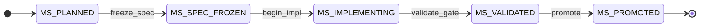
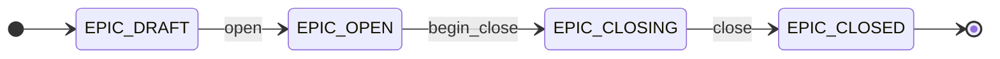
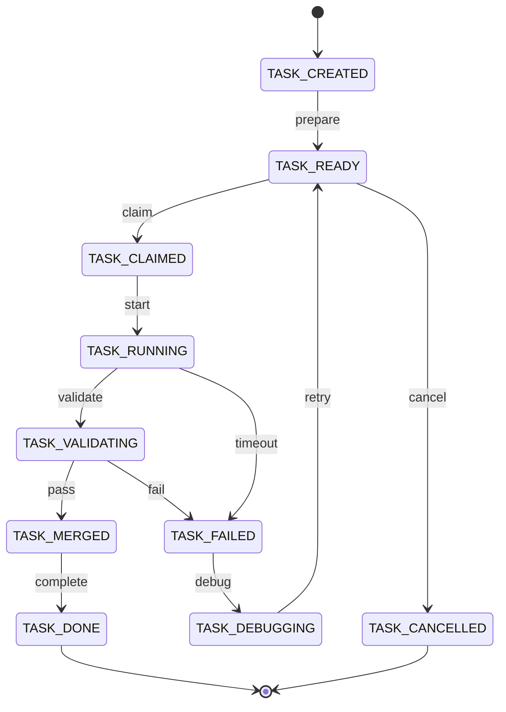
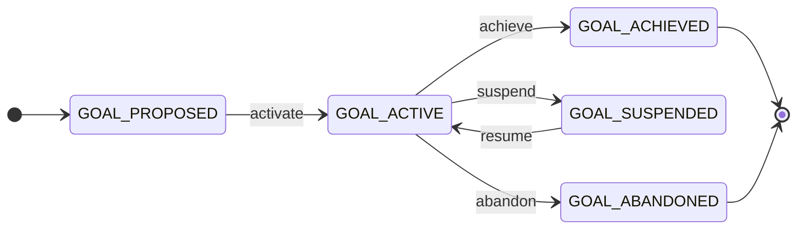
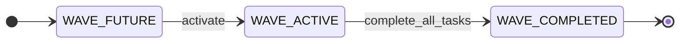
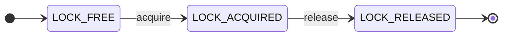
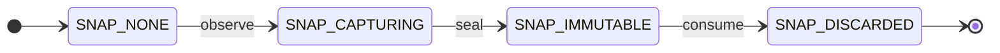
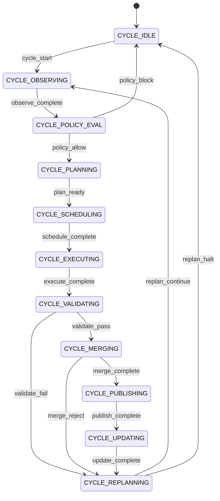

# ASEP — Global State Machine (L2)

- **Status:** Frozen (Architect 2026-06-25) — **L2.1 amendment** 2026-06-25 (Goal guards, T-00, C-07 owner split; DR-001 + Architect sign-off)
- **Layer:** L2 — **states**. The executable behavioral model of the platform. Extends ADR-0025 (packet FSM) to all L0 entities and binds every transition to L1 invariants and L3 cycle ownership.
- **Scope:** Platform plane only. Product plane domain state is out of scope (L0 §2).
- **Authority:** ADR-0028 §1 (L2 extends ADR-0025). **Does not modify** L0, L1, L3, or existing ADRs — only extends them. Semantic *why* lives in `behavioral-semantics.md` (ADR-0029).
- **Derivation:** Consolidates `decisions/ADR-0025`, `builder_engine/state_machine.py`, `builder_engine/runtime.py`, `plans/builder/STATE.yaml`, and the lifecycles declared in L0 §5.

---

## 1. Purpose

The Global State Machine (GSM) is the **composition of entity-level state machines** whose transitions are the only legal way platform state may evolve. The Engineering Runtime (L3) **executes transitions**; it does not mutate state ad hoc.

```text
L0  objects + relations     (what exists)
L1  invariants              (what must always hold)
BS  behavioral semantics    (why objects collaborate)  ← behavioral-semantics.md
L2  global state machine    (what may change, how)     ← this document
L3  engineering cycle       (when transitions are invoked)
L4+ implementation          (code that executes transitions)
```

**Engineering philosophy:** every engineering operation is a **state transition**. No implicit transitions. No bypass. Recovery is itself a transition.

---

## 2. GSM architecture

The GSM is not one monolithic FSM. It is a **layered composition**:

```text
┌─────────────────────────────────────────────────────────────────┐
│  Cycle FSM (L3 projection) — one iteration per engineering cycle │
│  IDLE → OBSERVING → … → REPLANNING → IDLE                       │
└────────────────────────────┬────────────────────────────────────┘
                             │ invokes transitions on
         ┌───────────────────┼───────────────────┐
         ▼                   ▼                   ▼
   Project FSM          Workflow FSM         Resource FSM
   Goal, Milestone      Epic, Wave, Task     Lock, Artifact,
                                              Snapshot
         │                   │                   │
         └───────────────────┴───────────────────┘
                             │
                    Worker engagement FSM
                    (execution plane overlay)
```

**Composition rules:**

1. Every state belongs to exactly one L0 entity (§3).
2. Every transition has exactly one owner (§8).
3. Every transition references ≥1 L1 invariant as guard (§9).
4. Every transition emits ≥0 typed events; events never exist independently (§7).
5. Class A invariants are **precondition guards on the transition**. Class B invariants are evaluated on the **post-transition candidate state** by the invariant layer before commit (L1 §4).
6. Policy decisions (L5) may **block invocation** of a transition but never override an invariant.

---

## 3. Entity state catalogs (L0 traceability)

Every state is named `{ENTITY}_{STATE}`. No anonymous states.

### 3.1 Goal *(L0: Goal)*

| State | Meaning |
|-------|---------|
| `GOAL_PROPOSED` | Strategic objective drafted, not yet driving work |
| `GOAL_ACTIVE` | Objective authorised; milestones/epics may reference it |
| `GOAL_ACHIEVED` | All constituent milestones promoted or explicitly waived |
| `GOAL_SUSPENDED` | Paused by governance; no new scheduling |
| `GOAL_ABANDONED` | Terminated without achievement |

**Authority home:** Project state (`knowledge/context/`, `/goal`).

### 3.2 Milestone *(L0: Milestone — boundary object)*

| State | Meaning |
|-------|---------|
| `MS_PLANNED` | Milestone identified; no frozen spec |
| `MS_SPEC_FROZEN` | Spec + ADR (if any) frozen per ADR-0026 §5 |
| `MS_IMPLEMENTING` | Implementation authorised; tasks may run |
| `MS_VALIDATED` | Promotion gate evidence complete (ADR-0010) |
| `MS_PROMOTED` | Tag/gate recorded; terminal for this milestone |

**Authority home:** Project state (governance). Product Track delivers; Platform Track governs.

### 3.3 Epic *(L0: Epic)*

| State | Meaning |
|-------|---------|
| `EPIC_DRAFT` | Epic defined in planning; not yet executing |
| `EPIC_OPEN` | Active body of work (`STATE.yaml` epic field live) |
| `EPIC_CLOSING` | All tasks done or cancelled; promotion pending |
| `EPIC_CLOSED` | Terminal (`STATE.yaml status: closed`) |

**Authority home:** Workflow state (`plans/builder/STATE.yaml`).

### 3.4 Wave *(L0: Wave)*

| State | Meaning |
|-------|---------|
| `WAVE_FUTURE` | Wave number > active `STATE.wave`; tasks may be `ready` |
| `WAVE_ACTIVE` | Wave number == active `STATE.wave`; scheduling permitted |
| `WAVE_COMPLETED` | All tasks in wave terminal; advance eligible |

**Authority home:** Workflow state (`STATE.wave`).

### 3.5 Task *(L0: Task / Packet)* — extends ADR-0025

| State | Meaning | YAML projection (ADR-0025 §3) |
|-------|---------|-------------------------------|
| `TASK_CREATED` | Packet exists; dependencies may be open | — (not persisted) |

**Birth (L2.1):** `T-00 create_packet` — Build Control Plane adds packet to `STATE.yaml`. Not invoked by Engineering Runtime cycle; governance act outside C-*.

| `TASK_READY` | Dependencies satisfied; schedulable | `ready` |
| `TASK_CLAIMED` | Locks assigned; manifest pending dispatch | `in_progress`* |
| `TASK_RUNNING` | Worker dispatched; execution in flight | `in_progress` |
| `TASK_VALIDATING` | Checks running | `in_progress`* |
| `TASK_MERGED` | Checks passed; merge eligibility set | `in_progress`* |
| `TASK_DONE` | Terminal success | `done` |
| `TASK_FAILED` | Validation or execution failed | `blocked`* |
| `TASK_DEBUGGING` | Human/agent analysing failure | `blocked` |
| `TASK_CANCELLED` | Terminal abandonment | `cancelled` |

\*Era I YAML projection collapses intermediate states — see §12 Gap analysis.

### 3.6 Artifact *(L0: Artifact)*

| State | Meaning |
|-------|---------|
| `ART_ABSENT` | Path not yet created |
| `ART_DRAFT` | Created by worker; mutable |
| `ART_PRODUCED` | Committed output; not yet governance-frozen |
| `ART_FROZEN` | Spec/ADR freeze act applied; immutable (INV-B1) |

**Authority home:** Filesystem / git. Freeze act: Human Operator (Architect).

### 3.7 Lock *(L0: Lock)*

| State | Meaning |
|-------|---------|
| `LOCK_FREE` | Path unclaimed |
| `LOCK_ACQUIRED` | Path → task mapping in `file_locks` |
| `LOCK_RELEASED` | Lock removed after task terminal transition |

**Authority home:** Workflow state (`file_locks`).

### 3.8 Snapshot *(L0: Snapshot / ObservedSnapshot)*

| State | Meaning |
|-------|---------|
| `SNAP_NONE` | No snapshot for current cycle |
| `SNAP_CAPTURING` | Observe phase aggregating inputs |
| `SNAP_IMMUTABLE` | Sealed read model for one cycle |
| `SNAP_DISCARDED` | Consumed; next cycle begins at `SNAP_NONE` |

**Authority home:** Ephemeral (Engineering Runtime memory / `.builder-engine/`).

### 3.9 Worker engagement *(L0: Worker — overlay on Task)*

Worker is a **role**, not a persistent entity. Engagement tracks one dispatch:

| State | Meaning |
|-------|---------|
| `WK_IDLE` | No active dispatch |
| `WK_DISPATCHED` | Manifest emitted; worker not yet started |
| `WK_EXECUTING` | Worker active in worktree |
| `WK_REPORTED` | Worker signalled completion (success or failure report) |
| `WK_TIMED_OUT` | Worker exceeded policy timeout |

**Authority home:** Execution plane (manifest + operator).

### 3.10 Static / non-lifecycle L0 objects

| Object | GSM treatment |
|--------|---------------|
| **Event** | Produced only by transitions (§7). No independent lifecycle. |
| **Invariant** | Static catalog (L1). Enforced as guards, not stateful. |
| **Policy** | Evaluated per cycle (L3 §3.2). Output is `PolicyDecision`, not entity state. |

---

## 4. Transition diagrams

### 4.1 Milestone (project governance)



### 4.2 Epic (workflow container)



### 4.3 Task (extends ADR-0025)



### 4.4 Goal



### 4.5 Wave



### 4.6 Lock (per path)



### 4.7 Snapshot (per cycle)



### 4.8 Engineering Cycle (L3 projection)



---

## 5. Master transition table

Each row is deterministic. **Owner** is singular. **Inv** = L1 invariant IDs guarding this transition. **Class B pass** runs on all rows before StateWriter commit.

### 5.1 Goal transitions

| ID | From | Trigger | To | Owner | Pre | Post | Events | Failures | Recovery | Rollback |
|----|------|---------|-----|-------|-----|------|--------|----------|----------|----------|
| G-01 | `GOAL_PROPOSED` | `activate` | `GOAL_ACTIVE` | Human Operator | goal defined; ≥1 linked Milestone at `MS_PLANNED` or later | milestones linkable | `GoalActivated` | `NO_MILESTONE` | define milestone | — |
| G-02 | `GOAL_ACTIVE` | `achieve` | `GOAL_ACHIEVED` | Human Operator | all MS `PROMOTED` or waived | goal closed | `GoalAchieved` | `MS_NOT_PROMOTED` | fix milestone | — |
| G-03 | `GOAL_ACTIVE` | `suspend` | `GOAL_SUSPENDED` | Human Operator | no Task in `TASK_CLAIMED`/`RUNNING`/`VALIDATING`/`MERGED` | no new schedules | `GoalSuspended` | `TASKS_IN_FLIGHT` | wait or force (policy) | — |
| G-04 | `GOAL_SUSPENDED` | `resume` | `GOAL_ACTIVE` | Human Operator | — | scheduling re-enabled | `GoalResumed` | — | — | — |
| G-05 | `GOAL_ACTIVE` | `abandon` | `GOAL_ABANDONED` | Human Operator | all Tasks `TASK_DONE` or `TASK_CANCELLED` | terminal | `GoalAbandoned` | `TASKS_OPEN` | cancel tasks | — |

**Inv:** G-02 → INV-B2; G-03 → INV-B6 (wave/task coherence on suspend write); G-04, G-05 → INV-B8 (atomic project-state write).

### 5.2 Milestone transitions

| ID | From | Trigger | To | Owner | Pre | Post | Events | Failures | Recovery | Rollback |
|----|------|---------|-----|-------|-----|------|--------|----------|----------|----------|
| M-01 | `MS_PLANNED` | `freeze_spec` | `MS_SPEC_FROZEN` | Human Operator | spec exists | artifacts `ART_FROZEN` | `MilestoneSpecFrozen` | `SPEC_INCOMPLETE` | complete spec | — |
| M-02 | `MS_SPEC_FROZEN` | `begin_impl` | `MS_IMPLEMENTING` | Build Control Plane | freeze recorded | tasks creatable | `MilestoneImplementing` | `SPEC_NOT_FROZEN` | re-freeze | — |
| M-03 | `MS_IMPLEMENTING` | `validate_gate` | `MS_VALIDATED` | Validator | gate evidence | promotion eligible | `MilestoneValidated` | `GATE_FAIL` | fix + re-validate | — |
| M-04 | `MS_VALIDATED` | `promote` | `MS_PROMOTED` | Promotion Engine | gate green | tag recorded | `PromotionCompleted` | `INV_VIOLATION` | halt | — |

**Inv:** M-01 → INV-B7; M-04 → INV-B2.

### 5.3 Epic transitions

| ID | From | Trigger | To | Owner | Pre | Post | Events | Failures | Recovery | Rollback |
|----|------|---------|-----|-------|-----|------|--------|----------|----------|----------|
| E-01 | `EPIC_DRAFT` | `open` | `EPIC_OPEN` | Build Control Plane | epic defined | `STATE.yaml` live | `EpicOpened` | — | — | — |
| E-02 | `EPIC_OPEN` | `begin_close` | `EPIC_CLOSING` | Planner | all tasks terminal | no new tasks | `EpicClosing` | `TASKS_OPEN` | complete tasks | — |
| E-03 | `EPIC_CLOSING` | `close` | `EPIC_CLOSED` | Engineering Runtime | promotion or waive | `status: closed` | `EpicClosed` | — | — | — |

**Inv:** E-01 → INV-B8; E-02 → INV-A3 (no open non-terminal tasks).

### 5.4 Wave transitions

| ID | From | Trigger | To | Owner | Pre | Post | Events | Failures | Recovery | Rollback |
|----|------|---------|-----|-------|-----|------|--------|----------|----------|----------|
| W-01 | `WAVE_FUTURE` | `activate` | `WAVE_ACTIVE` | Engineering Runtime | prior wave `COMPLETED` | `STATE.wave` set | `WaveActivated` | `PRIOR_INCOMPLETE` | complete prior | — |
| W-02 | `WAVE_ACTIVE` | `complete_all_tasks` | `WAVE_COMPLETED` | Engineering Runtime | all wave tasks terminal | advance eligible | `WaveCompleted` | — | — | — |
| W-03 | `WAVE_COMPLETED` | `advance` | (next `WAVE_ACTIVE`) | Engineering Runtime | `WaveCompleted` | `STATE.wave++` | `WaveAdvanced` | — | — | revert wave # (manual) |

**Inv:** W-01 → INV-B6; W-03 → INV-B6.

**Inv:** E-02 → INV-A3 (no open non-terminal tasks).

### 5.5 Task transitions (ADR-0025 extended)

| ID | From | Trigger | To | Owner | Pre | Post | Events | Failures | Recovery | Rollback |
|----|------|---------|-----|-------|-----|------|--------|----------|----------|----------|
| T-00 | `(none)` | `create_packet` | `TASK_CREATED` | Build Control Plane | epic `EPIC_OPEN`; unique packet id | packet row in STATE | `TaskCreated` | `DUPLICATE_ID` | fix id | remove row |
| T-01 | `TASK_CREATED` | `prepare` | `TASK_READY` | Planner | deps declared | schedulable if deps done | `TaskPrepared` | `DEPS_UNKNOWN` | fix graph | — |
| T-02 | `TASK_READY` | `claim` | `TASK_CLAIMED` | Scheduler | deps `DONE`; wave active | locks assigned | `TaskClaimed`, `LockAcquired` | `LOCK_CONFLICT`, `POLICY_BLOCK` | replan | release locks |
| T-03 | `TASK_CLAIMED` | `start` | `TASK_RUNNING` | Scheduler | manifest built | worker dispatchable | `ExecutionStarted`, `TaskScheduled` | `MANIFEST_FAIL` | unclaim | T-10 cancel path |
| T-04 | `TASK_RUNNING` | `validate` | `TASK_VALIDATING` | Engineering Runtime | worker reported | checks eligible | `ValidationStarted` | `NOT_RUNNING` | — | — |
| T-05 | `TASK_VALIDATING` | `pass` | `TASK_MERGED` | Validator | all checks green | merge eligible | `ValidationPassed` | `CHECK_FAIL`→T-07 | — | — |
| T-06 | `TASK_MERGED` | `complete` | `TASK_DONE` | Engineering Runtime | merge policy satisfied | locks released | `TaskCompleted`, `LockReleased` | — | — | — |
| T-07 | `TASK_VALIDATING` | `fail` | `TASK_FAILED` | Validator | any check red | failure recorded | `ValidationFailed` | — | T-08 | — |
| T-08 | `TASK_FAILED` | `debug` | `TASK_DEBUGGING` | Human Operator | — | analysis in progress | `TaskDebugStarted` | — | — | — |
| T-09 | `TASK_DEBUGGING` | `retry` | `TASK_READY` | Planner | root cause noted | re-enter queue | `TaskRetryScheduled` | — | — | — |
| T-10 | `TASK_READY` | `cancel` | `TASK_CANCELLED` | Human Operator | — | terminal | `TaskCancelled` | — | — | — |
| T-11 | `TASK_RUNNING` | `timeout` | `TASK_FAILED` | Engineering Runtime | elapsed > policy timeout | timeout recorded | `TaskFailed`, `TaskTimedOut` | — | T-08 | — |
| T-12 | `TASK_CLAIMED` | `abort_claim` | `TASK_READY` | Scheduler | dispatch failed | locks released | `TaskClaimAborted`, `LockReleased` | `DISPATCH_ERR` | retry T-02 | — |

**Inv:** T-02 → INV-A5, INV-B3, INV-B4, INV-B5; T-03 → INV-B6; T-04 → INV-A1; T-05 → INV-A2; T-06 → INV-A2, INV-A3; T-07 → INV-A1; T-09 → INV-A4; T-10 → INV-A3.

### 5.6 Artifact transitions

| ID | From | Trigger | To | Owner | Pre | Post | Events | Failures | Recovery | Rollback |
|----|------|---------|-----|-------|-----|------|--------|----------|----------|----------|
| A-01 | `ART_ABSENT` | `create` | `ART_DRAFT` | Worker | task `RUNNING` | file exists | `ArtifactCreated` | — | — | delete file (manual) |
| A-02 | `ART_DRAFT` | `commit` | `ART_PRODUCED` | Worker | content complete | git tracked | `ArtifactProduced` | — | — | — |
| A-03 | `ART_PRODUCED` | `freeze` | `ART_FROZEN` | Human Operator | Architect sign-off | immutable | `ArtifactFrozen`, `MilestoneSpecFrozen`† | — | — | **forbidden** (INV-B1) |

† May coincide with M-01.

**Inv:** A-03 → INV-B1, INV-B7. **Violation of INV-B1:** any write to `ART_FROZEN` → `InvariantViolation`, halt.

### 5.7 Lock transitions (per path)

| ID | From | Trigger | To | Owner | Pre | Post | Events | Failures | Recovery | Rollback |
|----|------|---------|-----|-------|-----|------|--------|----------|----------|----------|
| L-01 | `LOCK_FREE` | `acquire` | `LOCK_ACQUIRED` | Scheduler | owner task `CLAIMED`; path ⊆ `owned_files` | `file_locks` updated | `LockAcquired` | `OVERLAP` | pick other task | remove lock entry |
| L-02 | `LOCK_ACQUIRED` | `release` | `LOCK_RELEASED` | Engineering Runtime | owner task terminal | lock removed | `LockReleased` | — | — | — |

**Inv:** L-01 → INV-B3, INV-B4, INV-B5; L-02 → INV-B4.

### 5.8 Snapshot transitions (per cycle)

| ID | From | Trigger | To | Owner | Pre | Post | Events | Failures | Recovery | Rollback |
|----|------|---------|-----|-------|-----|------|--------|----------|----------|----------|
| S-01 | `SNAP_NONE` | `observe` | `SNAP_CAPTURING` | Engineering Runtime | cycle started | aggregation running | `SnapshotCreating` | — | — | — |
| S-02 | `SNAP_CAPTURING` | `seal` | `SNAP_IMMUTABLE` | Engineering Runtime | all inputs read | snapshot sealed | `SnapshotCreated`, `StateObserved` | `STALE_INPUT` | abort cycle | discard partial |
| S-03 | `SNAP_IMMUTABLE` | `consume` | `SNAP_DISCARDED` | Engineering Runtime | phase complete | ephemeral freed | — | — | — | — |

**Inv:** S-02 → INV-B8 (snapshot is derived, never authoritative over Workflow state).

### 5.9 Worker engagement transitions

| ID | From | Trigger | To | Owner | Pre | Post | Events | Failures | Recovery | Rollback |
|----|------|---------|-----|-------|-----|------|--------|----------|----------|----------|
| K-01 | `WK_IDLE` | `dispatch` | `WK_DISPATCHED` | Scheduler | manifest entry exists | worker notified | `WorkerDispatched` | — | — | — |
| K-02 | `WK_DISPATCHED` | `begin` | `WK_EXECUTING` | Worker | worktree ready | task `RUNNING` | `WorkerExecutionStarted` | `WORKTREE_FAIL` | T-12 | — |
| K-03 | `WK_EXECUTING` | `report` | `WK_REPORTED` | Worker | output ready | completion signal | `WorkerReported`, `TaskCompleted`† | — | — | — |
| K-04 | `WK_EXECUTING` | `timeout` | `WK_TIMED_OUT` | Engineering Runtime | policy elapsed | — | `WorkerTimedOut`, `TaskTimedOut` | — | T-11 | — |

† `TaskCompleted` here means worker-reported; task FSM still requires T-04→T-06.

**Inv:** K-02 → INV-B9; K-03 → INV-B9 (worker reports; runtime commits).

### 5.10 Cycle phase transitions (L3 binding)

| ID | From | Trigger | To | Owner | Entity transitions invoked | Events |
|----|------|---------|-----|-------|---------------------------|--------|
| C-01 | `CYCLE_IDLE` | `cycle_start` | `CYCLE_OBSERVING` | Engineering Runtime | S-01 | `CycleStarted` |
| C-02 | `CYCLE_OBSERVING` | `observe_complete` | `CYCLE_POLICY_EVAL` | Engineering Runtime | S-02 | `StateObserved` |
| C-03 | `CYCLE_POLICY_EVAL` | `policy_allow` | `CYCLE_PLANNING` | Policy Engine | — | `PolicyAllowed` |
| C-04 | `CYCLE_POLICY_EVAL` | `policy_block` | `CYCLE_IDLE` | Policy Engine | — | `PolicyBlocked` |
| C-05 | `CYCLE_PLANNING` | `plan_ready` | `CYCLE_SCHEDULING` | Planner | T-01 (batch) | `PlanGenerated` |
| C-06 | `CYCLE_SCHEDULING` | `schedule_complete` | `CYCLE_EXECUTING` | Scheduler | T-02, T-03, L-01, K-01 | `TaskScheduled` |
| C-07a | `CYCLE_EXECUTING` | `worker_begin` | `CYCLE_EXECUTING` | Worker | K-02 | `WorkerExecutionStarted` |
| C-07b | `CYCLE_EXECUTING` | `worker_report` | `CYCLE_EXECUTING` | Worker | K-03, A-01, A-02 | `WorkerReported`, `ArtifactProduced` |
| C-07c | `CYCLE_EXECUTING` | `execute_complete` | `CYCLE_VALIDATING` | Engineering Runtime | T-04 pending (after K-03) | `ExecutionStarted` |
| C-08 | `CYCLE_VALIDATING` | `validate_pass` | `CYCLE_MERGING` | Validator | T-04, T-05 | `ValidationPassed` |
| C-09 | `CYCLE_VALIDATING` | `validate_fail` | `CYCLE_REPLANNING` | Validator | T-04, T-07 | `ValidationFailed` |
| C-10 | `CYCLE_MERGING` | `merge_complete` | `CYCLE_PUBLISHING` | Integrator | T-06 (partial) | `MergeAccepted` |
| C-11 | `CYCLE_MERGING` | `merge_reject` | `CYCLE_REPLANNING` | Integrator | — | `MergeRejected` |
| C-12 | `CYCLE_PUBLISHING` | `publish_complete` | `CYCLE_UPDATING` | Engineering Runtime | all §7 events | `EventsPublished` |
| C-13 | `CYCLE_UPDATING` | `update_complete` | `CYCLE_REPLANNING` | Engineering Runtime | W-02, W-03, E-02, L-02, S-03 | `StateUpdated`, `WaveAdvanced` |
| C-14 | `CYCLE_REPLANNING` | `replan_continue` | `CYCLE_OBSERVING` | Planner | T-09 (if needed) | `Replanned` |
| C-15 | `CYCLE_REPLANNING` | `replan_halt` | `CYCLE_IDLE` | Human Operator | — | `CycleHalted` |

**Inv (all cycle writes):** Class B pass on every C-* that commits Workflow state → INV-B8 minimum.

---

## 6. Ownership matrix

Exactly one owner per transition. "Engineering Runtime" = deterministic sidecar (`builder_engine/`).

| Owner | Transitions | L3 phase |
|-------|-------------|----------|
| **Human Operator** | G-01, G-03–G-05, M-01, A-03, T-08, T-10, C-15 | Control Plane governance |
| **Build Control Plane** | T-00, M-02, E-01 | Intent + authorisation |
| **Promotion Engine** | M-04 | Post-validation promotion (ADR-0010) |
| **Planner** | T-01, T-09, E-02, C-05, C-14 | Plan, Replan |
| **Scheduler** | T-02, T-03, T-12, L-01, K-01, C-06 | Schedule |
| **Worker** | K-02, K-03, A-01, A-02, C-07a, C-07b | Execute |
| **Validator** | T-05, T-07, M-03, C-08, C-09 | Validate |
| **Integrator** | C-10, C-11 | Merge (worker role) |
| **Policy Engine** | C-03, C-04 | Evaluate Policies |
| **Engineering Runtime** | T-04, T-06, T-11, W-01–W-03, E-03, L-02, S-01–S-03, K-04, C-01–C-02, C-07c, C-12–C-13 | Observe, Update State, invariant enforcement |

No transition has multiple owners. Integrator is a Worker subtype; listed separately because Merge ownership is distinct in L3 §3.7.

---

## 7. Event matrix

Events are emitted **only** by transitions. Format: `{Entity}{Action}` in PascalCase, aligned with L3 §3 and ADR-0026 §7.

| Event | Transition ID | Producer (owner) |
|-------|---------------|------------------|
| `GoalActivated` | G-01 | Human Operator |
| `TaskCreated` | T-00 | Build Control Plane |
| `GoalAchieved` | G-02 | Human Operator |
| `GoalSuspended` | G-03 | Human Operator |
| `GoalResumed` | G-04 | Human Operator |
| `GoalAbandoned` | G-05 | Human Operator |
| `MilestoneSpecFrozen` | M-01 | Human Operator |
| `MilestoneImplementing` | M-02 | Build Control Plane |
| `MilestoneValidated` | M-03 | Validator |
| `PromotionCompleted` | M-04 | Promotion Engine |
| `EpicOpened` | E-01 | Build Control Plane |
| `EpicClosing` | E-02 | Planner |
| `EpicClosed` | E-03 | Engineering Runtime |
| `WaveActivated` | W-01 | Engineering Runtime |
| `WaveCompleted` | W-02 | Engineering Runtime |
| `WaveAdvanced` | W-03 | Engineering Runtime |
| `TaskPrepared` | T-01 | Planner |
| `TaskClaimed` | T-02 | Scheduler |
| `TaskScheduled` | T-03 | Scheduler |
| `ExecutionStarted` | T-03, C-07 | Scheduler / Runtime |
| `ValidationStarted` | T-04 | Engineering Runtime |
| `ValidationPassed` | T-05 | Validator |
| `ValidationFailed` | T-07 | Validator |
| `TaskCompleted` | T-06 | Engineering Runtime |
| `TaskDebugStarted` | T-08 | Human Operator |
| `TaskRetryScheduled` | T-09 | Planner |
| `TaskCancelled` | T-10 | Human Operator |
| `TaskFailed` | T-11 | Engineering Runtime |
| `TaskTimedOut` | T-11 | Engineering Runtime |
| `TaskClaimAborted` | T-12 | Scheduler |
| `ArtifactCreated` | A-01 | Worker |
| `ArtifactProduced` | A-02 | Worker |
| `ArtifactFrozen` | A-03 | Human Operator |
| `LockAcquired` | L-01, T-02 | Scheduler |
| `LockReleased` | L-02, T-06, T-12 | Engineering Runtime / Scheduler |
| `SnapshotCreating` | S-01 | Engineering Runtime |
| `SnapshotCreated` | S-02 | Engineering Runtime |
| `StateObserved` | S-02 | Engineering Runtime |
| `WorkerDispatched` | K-01 | Scheduler |
| `WorkerExecutionStarted` | K-02 | Worker |
| `WorkerReported` | K-03 | Worker |
| `WorkerTimedOut` | K-04 | Engineering Runtime |
| `CycleStarted` | C-01 | Engineering Runtime |
| `PolicyAllowed` | C-03 | Policy Engine |
| `PolicyBlocked` | C-04 | Policy Engine |
| `PlanGenerated` | C-05 | Planner |
| `MergeAccepted` | C-10 | Integrator |
| `MergeRejected` | C-11 | Integrator |
| `EventsPublished` | C-12 | Engineering Runtime |
| `StateUpdated` | C-13 | Engineering Runtime |
| `Replanned` | C-14 | Planner |
| `CycleHalted` | C-15 | Human Operator |

**Rule:** no event without a transition ID. No transition without a declared event (may be `—` only for S-03 consume).

---

## 8. Invariant mapping (complete)

| Invariant | Protected transitions | Violation if attempted | Guard type |
|-----------|------------------------|------------------------|------------|
| **INV-A1** | T-04, T-07 | `validate`/`fail` not from `RUNNING`/`VALIDATING` | Class A |
| **INV-A2** | T-05, T-06 | `complete`/`pass` without validation evidence | Class A |
| **INV-A3** | T-06, T-10, E-02 | `DONE`/`CANCELLED` re-entry | Class A |
| **INV-A4** | T-09 | `retry` not from `DEBUGGING` | Class A |
| **INV-A5** | T-02, T-03 | schedule with open deps | Class A + graph |
| **INV-B1** | A-03, M-01 | mutate `ART_FROZEN` | Class B |
| **INV-B2** | M-04, G-02 | promote without validation | Class B |
| **INV-B6** | T-03, W-01, W-03, G-03 | in-flight task wrong wave / suspend with active tasks | Class B |
| **INV-B8** | G-04, G-05, E-01, all commits | partial Workflow write | Class B |
| **INV-B3** | T-02, L-01 | acquire over existing lock | Class B |
| **INV-B4** | L-01, L-02 | lock outside `owned_files` | Class B |
| **INV-B5** | T-02, L-01 | overlapping `owned_files` | Class B |
| **INV-B6** | T-03, W-01, W-03 | in-flight task wrong wave | Class B |
| **INV-B7** | M-01, A-03, C-05 | planner mutates frozen artifact | Class B |
| **INV-B8** | all commits | partial Workflow write | Class B |
| **INV-B9** | K-02, K-03 | worker writes Workflow state | Class B |

**Coverage rule (completion criterion):** every transition in §5 references ≥1 invariant. Verified: all T-*, M-*, L-*, A-03, W-*, E-02 rows covered. G-*, E-01, E-03, S-*, K-*, C-* policy-only rows covered via Class B pass (INV-B8) plus row-specific IDs above.

---

## 9. Failure and recovery model

Failures are **classified**, **detected**, and **recovered through transitions** — never by silent state jump.

### 9.1 Failure taxonomy

| Class | Code | Detection | Example transitions |
|-------|------|-----------|---------------------|
| **Validation failure** | `VAL_FAIL` | CheckRunner / gate | T-07, M-03 gate, C-09 |
| **Execution failure** | `EXEC_FAIL` | Worker report | K-03 with failure payload → T-07 |
| **Policy violation** | `POL_VIOLATION` | Policy Engine | C-04 (block; not invariant) |
| **Invariant violation** | `INV_VIOLATION` | Invariant layer | any; halt before commit |
| **Timeout** | `TIMEOUT` | Runtime clock | T-11, K-04 |
| **Deadlock** | `DEADLOCK` | Planner detect | all tasks blocked, no ready set → C-15 |
| **Lock conflict** | `LOCK_CONFLICT` | Scheduler | T-02, L-01 → abort |
| **Stale snapshot** | `STALE_SNAP` | Observe | S-02 → abort cycle |
| **Merge conflict** | `MERGE_CONFLICT` | Integrator | C-11 |

### 9.2 Recovery paths (all via GSM)

| Failure | Recovery transition chain | Termination |
|---------|---------------------------|-------------|
| `VAL_FAIL` | T-07 → T-08 → T-09 → T-02 → … | T-06 `TASK_DONE` or T-10 `CANCELLED` |
| `EXEC_FAIL` | T-11/T-07 → T-08 → T-09 → … | same |
| `TIMEOUT` | T-11 → T-08 → T-09 → … | same |
| `LOCK_CONFLICT` | T-12 → (replan) → T-02 | schedule succeeds |
| `MERGE_CONFLICT` | C-11 → C-14 → T-09 | merge succeeds |
| `INV_VIOLATION` | **halt** → Human Operator | governance fix → manual replan |
| `DEADLOCK` | C-15 → human unblocks | C-01 restart |
| `POL_VIOLATION` | C-04 → C-15 or wait | C-03 allow |

**Forbidden recovery pattern:**

```text
TASK_RUNNING ──(direct fix)──▶ TASK_RUNNING   ✗
```

**Required recovery pattern:**

```text
TASK_RUNNING → TASK_VALIDATING → TASK_FAILED → TASK_DEBUGGING → TASK_READY → …
```

---

## 10. L3 phase ↔ GSM binding

| L3 phase (runtime-model §3) | Cycle state | Primary GSM transitions |
|----------------------------|-------------|-------------------------|
| Observe State | `CYCLE_OBSERVING` | S-01, S-02 |
| Evaluate Policies | `CYCLE_POLICY_EVAL` | C-03, C-04 |
| Plan | `CYCLE_PLANNING` | T-01, C-05 |
| Schedule | `CYCLE_SCHEDULING` | T-02, T-03, L-01, K-01 |
| Execute | `CYCLE_EXECUTING` | C-07a, C-07b, C-07c, K-02, K-03, A-01, A-02 |
| Validate | `CYCLE_VALIDATING` | T-04, T-05, T-07 |
| Merge | `CYCLE_MERGING` | T-06, C-10, C-11 |
| Publish Events | `CYCLE_PUBLISHING` | C-12, §7 all |
| Update State | `CYCLE_UPDATING` | W-02, W-03, L-02, E-03 |
| Replan | `CYCLE_REPLANNING` | T-09, C-14, C-15 |

---

## 11. Era I projection map (STATE.yaml ↔ GSM)

| GSM state | Era I persisted? | Where |
|-----------|------------------|-------|
| `TASK_*` | Partial | `packets.*.status` (5-value projection) |
| `EPIC_*` | Partial | `status: closed` ≈ `EPIC_CLOSED` only |
| `WAVE_*` | Partial | `wave:` integer; no explicit state |
| `MS_*` | Manual | promotion docs, tags, knowledge |
| `GOAL_*` | Manual | `/goal`, `knowledge/context/` |
| `LOCK_*` | Partial | `file_locks` presence/absence |
| `SNAP_*` | No | — |
| Cycle `CYCLE_*` | No | implicit in CLI invocation |

---

## 12. Gap analysis vs Era I runtime

| Area | GSM requirement | Era I today | Gap |
|------|-----------------|-------------|-----|
| Task FSM | All T-* transitions explicit | `state_machine.py` has core T-01–T-10; no T-11, T-12 | Add timeout/abort |
| Task YAML projection | 1:1 or explicit sub-states | Collapses CLAIMED/RUNNING/VALIDATING/MERGED → `in_progress` | Extend YAML or add `execution_state` field |
| Invariant guards | Class A on every transition | Only graph validate before schedule/sync | Wire INV-A* in FSM; Class B pass |
| INV-A1–A4 | Executable | ADR-0025 prose only | `GAP` → implement with L4 |
| Recovery T-08, T-09 | CLI/API transitions | Manual YAML edit | `builder-engine debug`, `retry` |
| Milestone FSM | M-01–M-04 | Manual governance | Not in engine (OK for Control Plane) |
| Epic FSM | E-01–E-03 | `status: closed` only | E-01, E-02 not persisted |
| Wave FSM | W-01–W-03 | Implicit in `sync()` wave advance | Formalize W-02, W-03 events |
| Snapshot FSM | S-01–S-03 | No unified snapshot | MB2 Observe (L4) |
| Cycle FSM | C-01–C-15 | CLI commands are partial projections | `EngineeringRuntime.cycle()` (L4) |
| Event emission | Every transition | No build event bus | L4 event bus |
| Merge phase | C-10, C-11 | Manual / skill | Integrator worker + eligibility |
| Promotion | M-04 | `docs/m{n}-promotion.md` manual | Promotion Engine (Control Plane) |
| `WorkflowRuntime` name | `EngineeringRuntime` | Legacy class name | Rename on MB2 branch |
| FAILED vs DEBUGGING | Distinct states | YAML `blocked` → DEBUGGING only | Optional YAML refinement |

**Conclusion:** Era I implements a **vertical slice** of the Task FSM (T-02, T-03, T-04, T-05, T-06, T-07) plus partial Wave advance. L2 declares the **complete** GSM; L4 (MB2) closes gaps incrementally without redesign.

---

## 13. Freeze record

- [x] Every L0 entity has a defined lifecycle (§3) or explicit static treatment (Event, Invariant, Policy)
- [x] Every transition deterministic (§5 master table)
- [x] Every transition has exactly one owner (§6)
- [x] Every transition references ≥1 invariant (§8)
- [x] Every emitted event traceable to a transition (§7)
- [x] Every failure path modeled with recovery via GSM (§9)
- [x] Recovery never bypasses state machine (§9.2)
- [x] L3 cycle bound to GSM (§10)
- [x] Gap analysis vs Era I (§12)
- [x] L2.1 amendment: Goal guards (G-01, G-03, G-05), T-00 birth, C-07 owner split (DR-001 + Architect 2026-06-25)
- [x] Behavioral Semantics companion frozen (ADR-0029) — *why* not duplicated here

**Implementation authorized:** L4 (MB2) after rebasing MB2 spec on this document. No production code before plan approval.

---

## 14. References

- L0 `docs/platform/engineering-meta-model.md`
- L1 `docs/platform/invariant-model.md`
- L3 `docs/platform/runtime-model.md`
- ADR-0025, ADR-0026, ADR-0028, ADR-0010, ADR-0023
- `builder_engine/state_machine.py`, `builder_engine/runtime.py`
- `plans/l2-global-state-machine-plan.md` (migration + implementation)
